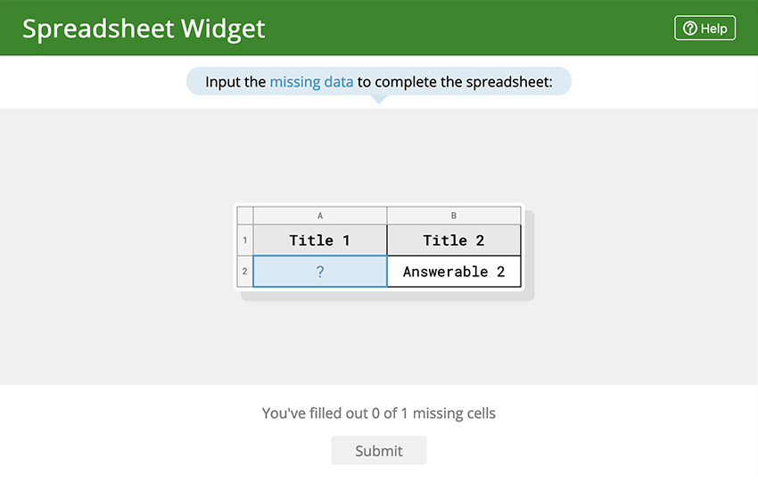

<h1>
	
	Secret Spreadsheet: A Materia Widget
</h1>

Secret Spreadsheet is a Materia Widget that is played by filling in the blanks on the provided spreadsheet. Players are scored based on how many answers are correct after the spreadsheet is submitted. The blank cells can be selected by the creator or be randomly generated. Spreadsheet is designed for use with [Materia](https://github.com/ucfopen/Materia), an open-source platform for interactive course content developed by the University of Central Florida.

### Basic Use

In a production evironment, Spreadsheet is installed to your Materia instance and is accessed via the Widget Catalog. For development, Spreadsheet is bundled with the [Materia Widget Development Kit](https://github.com/ucfopen/Materia-Widget-Dev-Kit), which allows for rapid development in a local context using express.js.

### Local Development

Spreadsheet uses the Materia Widget Development Kit for local development. Check out [the docs for the MDK](https://ucfopen.github.io/Materia-Docs/develop/materia-widget-development-kit.html) to learn more about starting up the local express environment.

### Installation to Materia

Widget installation options are covered in the [Installing Widgets](https://ucfopen.github.io/Materia-Docs/admin/installing-widgets.html) section of the Materia Docs.

For more information about the widget development process, be sure to visit the [widget developer guide](https://ucfopen.github.io/Materia-Docs/develop/widget-developer-guide.html) for Materia.