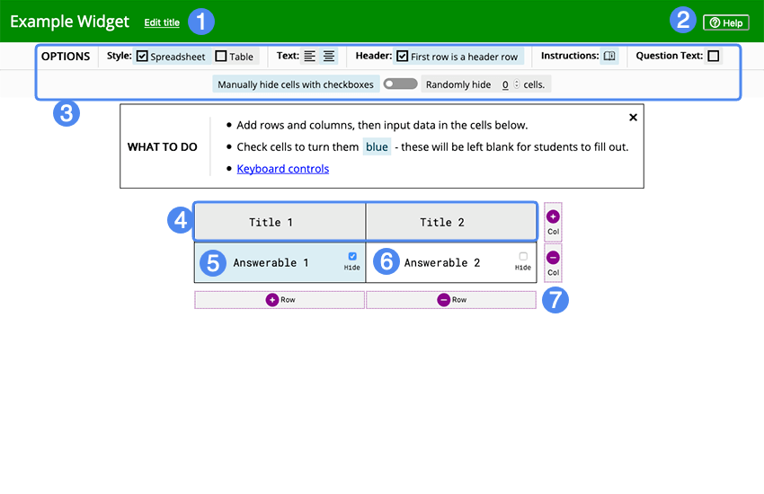

## Overview

Students must fill in the blanks on a spreadsheet. The blanks can be either randomized or fixed.

1. Editable Widget Title
2. Help Button
3. Options Bar
4. Title Cells
5. Hidden Cell
6. Shown Cell
7. Buttons to expand/shrink the table

## Details

### How to Make the Spreadsheet

First, give your widget a name (this can be changed later). Then select the options you want for the spreadsheet styling:

1. Include spreadsheet style cell labeling
2. Center or left align text
3. Make the first row a header

Then add in rows and columns to the spreadsheet and fill in the cells with the information. You can check a cell to hide it from the student. If you want to make the cells randomly hidden instead, enter the number of cells you want hidden in the options bar. You can still check the cells you want hidden, but the player will disregard it.

### Playing

Students will fill in the blanks in the spreadsheet. After they have filled in all the blanks that they wish, they can submit their response for scoring.

### Scoring

Students' scores will be based on what percentage of blanks they filled in correctly. The answers are case, spelling, and spacing sensitive, so only an exact match will count as correct.