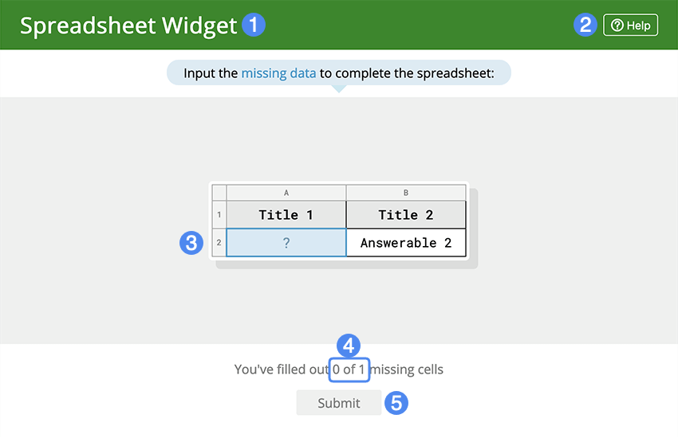

## Overview

Students must fill in the blanks on a spreadsheet. The blanks can be either randomized or fixed.

## Details

### Filling in the blanks

Blanks that still need to be answered will be highlighted in blue and will have a question mark. Blanks that have been filled in will be highlighted in yellow. There is a running tally of how many blanks have been filled in out of all of the blanks at the bottom.

### Question and description

There may be an accompanying question, description, or instructions that pop up before you are able to use the spreadsheet. If you want to read it again, click the **View Question** text.

### Submitting

When you have filled in all then blanks that you want to, click on the **Submit** button. You will be scored based on how many blanks were filled with the correct information, spelling, capitalization, and spaces do matter. 